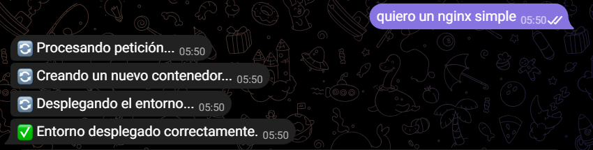
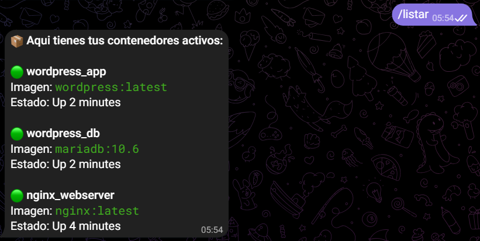
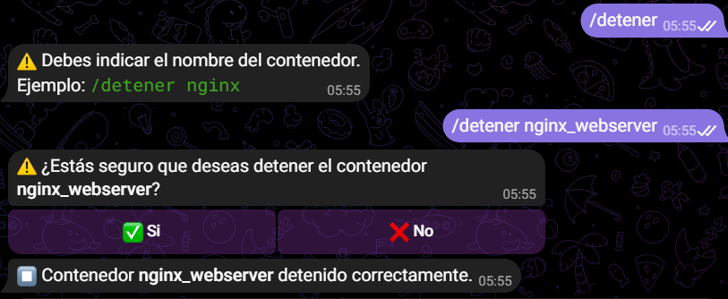
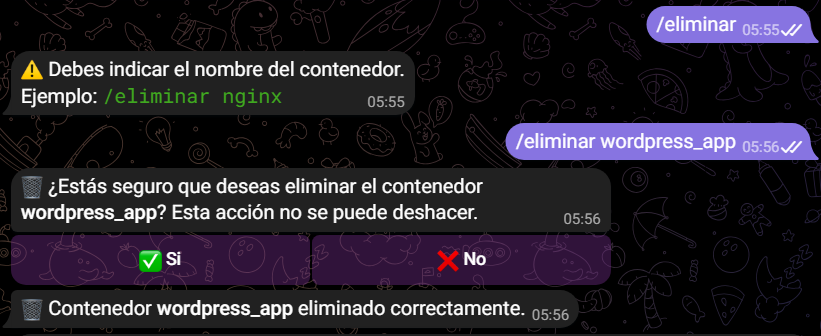
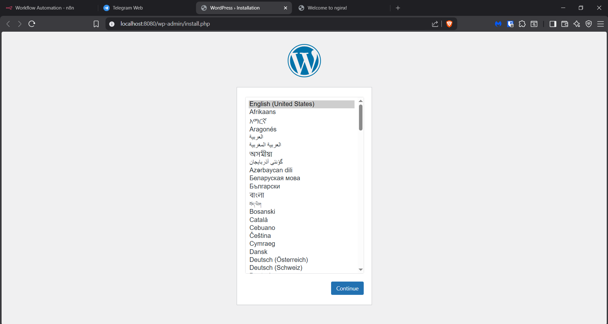
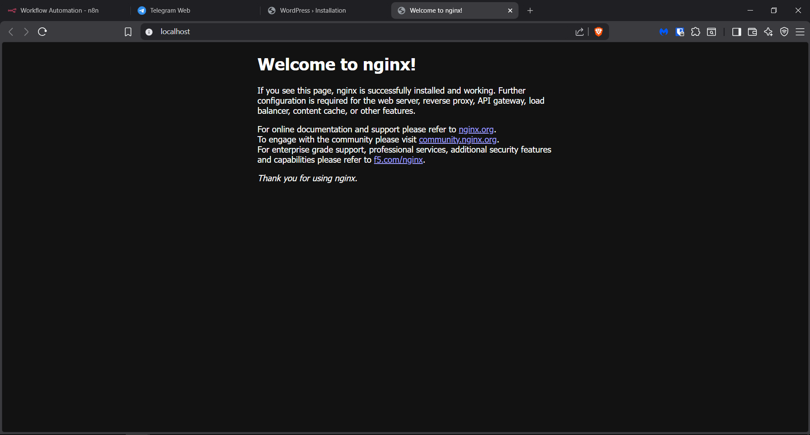

# Docker Interno

Bot de Telegram con IA que genera y despliega entornos Docker automáticamente a partir de descripciones en lenguaje natural.


---

## ¿Qué es Docker Interno?

El usuario describe desde Telegram lo que necesita y el sistema lo levanta solo:

> "Quiero un Nginx con PHP"
> → El bot genera el docker-compose.yml, despliega el contenedor y confirma al usuario.

---

## Arquitectura

```
Usuario (Telegram)
        ↓
   Ngrok Tunnel (HTTPS permanente)
        ↓
      n8n (orquestador)
     ↙          ↘
AI Agent      Switch de comandos
(OpenRouter)   ↙      ↓       ↘
    ↓        listar detener eliminar
Genera YAML      ↓      ↓       ↓
    ↓         docker  docker  docker
Despliega      ps     stop    rm -f
contenedor
    ↓
Telegram responde al usuario
```

Todos los servicios corren en una red bridge interna `internal_bridge`. Solo n8n está expuesto al exterior a través de Ngrok.

---

## Tecnologías utilizadas

| Herramienta | Rol |
|-------------|-----|
| **n8n** | Orquestador del flujo completo |
| **OpenRouter + Gemini 2.0 Flash** | IA generadora de entornos Docker |
| **Docker + Docker Compose** | Despliegue de contenedores |
| **Telegram Bot API** | Interfaz de usuario |
| **Ngrok** | Túnel HTTPS permanente sin abrir puertos |
| **OpenHands** | Agente de despliegue auxiliar |

---

## Estructura de carpetas

```
docker-interno/
├── docker-compose.yml
├── .env
├── generated/
├── openhands_data/
└── n8n/
    └── Dockerfile
```

---

## Requisitos previos

- [Docker Desktop](https://www.docker.com/products/docker-desktop/) instalado y corriendo
- Cuenta gratuita en [OpenRouter](https://openrouter.ai) con API key
- Cuenta gratuita en [Ngrok](https://ngrok.com) con authtoken y dominio estático
- Bot de Telegram creado con [BotFather](https://t.me/BotFather) y su token

---

## Configuración del .env

Crea un fichero `.env` en la raíz del proyecto con estas variables:

```env
# n8n
N8N_BASIC_AUTH_USER=admin
N8N_BASIC_AUTH_PASSWORD=tu_contraseña_segura

# Ngrok
NGROK_AUTHTOKEN=tu_authtoken_de_ngrok
NGROK_DOMAIN=tu-dominio.ngrok-free.app

# n8n con Ngrok
N8N_HOST=tu-dominio.ngrok-free.app
N8N_PROTOCOL=https
WEBHOOK_URL=https://tu-dominio.ngrok-free.app
```

> ⚠️ Nunca subas el `.env` a GitHub. Está incluido en el `.gitignore`.

---

## Cómo arrancar el proyecto

### 1 — Clonar el repositorio

```bash
git clone https://github.com/doomiZh/docker-interno.git
cd docker-interno
```

### 2 — Configurar el .env

Copia el fichero de ejemplo y rellena tus valores:

```bash
cp .env.example .env
```

### 3 — Construir y levantar los servicios

```bash
docker compose up -d --build
```

### 4 — Activar el flujo en n8n

1. Entra en `https://tu-dominio.ngrok-free.app`
2. Inicia sesión con las credenciales del `.env`
3. Importa el flujo desde `workflow/docker-interno.json`
4. Activa el flujo con el toggle **on**

---

## Cómo usar el bot

Busca `@dockerinterno_bot` en Telegram y empieza a usarlo.

| Comando | Descripción | Ejemplo |
|---------|-------------|---------|
| `/start` | Bienvenida al bot | `/start` |
| Descripción libre | Genera y despliega un entorno | `Quiero un Nginx simple` |
| `/listar` | Lista los contenedores activos | `/listar` |
| `/detener <nombre>` | Detiene un contenedor con confirmación | `/detener nginx` |
| `/eliminar <nombre>` | Elimina un contenedor con confirmación | `/eliminar nginx` |

---

## Flujo del workflow n8n

```
Obtén mensaje del usuario (Telegram Trigger)
            ↓
  Validar inicio del sistema (Switch)
   ↙              ↓               ↘
/start       callback_query       Fallback
  ↓                ↓                 ↓
Bienvenida    Proceso           Verificar si
              callbacks         contiene comandos
             ↙   ↓   ↘            ↙         ↘
          det  elm  ❌          true         false
           ↓    ↓            Maquetar      Maquetar
         stop  rm            comando       mensaje
           ↓    ↓               ↓             ↓
          ✅   ✅           Switch de      AI Agent
                            comandos          ↓
                           ↙  ↓  ↘       Genera YAML
                        list det elm         ↓
                                         Despliega
                                             ↓
                                         Telegram ✅
```

---

## Seguridad

Todos los contenedores generados por el bot incluyen esta label:

```yaml
labels:
  - "managed-by=dockerinterno_bot"
```

Los comandos `/listar`, `/detener` y `/eliminar` solo actúan sobre contenedores con esa label. Los contenedores del sistema (`n8n`, `ngrok`, `openhands`) nunca la tienen y son completamente intocables desde el bot.

---

## Capturas de pantalla

### Despliegue de un entorno


### Listar contenedores


### Confirmación de detener


### Confirmación de eliminar


### Pruebas de entornos web




---

*Proyecto realizado por ARQUIÑIGO CARRILLO, Diego*
